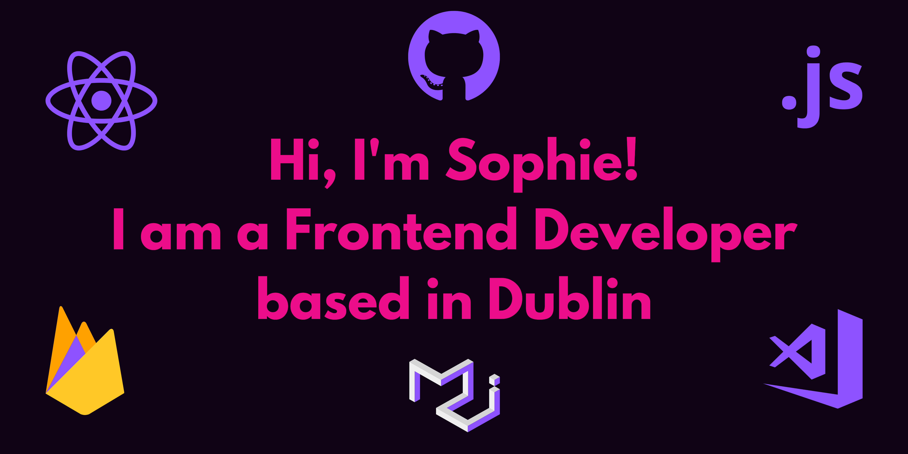

## 👧 **Some Info About Me!**

- 👩‍🎓 I completed a Full Stack Development Diploma with [Code Instute](https://codeinstitute.net/) in Sept. 2020!
- 🙏 Interest in Frontend positions with JavaScript & React.
- 😄 Smaller frontend projects can be found on [Code Pen](https://codepen.io/SophH93)
- 📱 Everything I learn, big or small, interesting websites etc I post on [Instagram](<(https://www.instagram.com/irishgirldeveloper/)>)
- 👩‍💻 I’m a member of [Clever Programmer](https://www.cleverprogrammer.com/), where I am building real life projects & [PAPA React](https://www.papareact.com/) where I learn all things Reactjs!
- ✨Also interested in Cybersecurity & Ethical Hacking.

## 🔧 **Technologies and Tools:**

## 🖱️ 

- [Youtube](https://github.com/SophieH93/youtube)
- [Job Search](https://github.com/SophieH93/SAAS-JobSearch)
- [Travelville](https://github.com/SophieH93/travelvilleMaterialze/blob/master/index.html)
- [Covid19 Tracker](https://github.com/SophieH93/Covid19Tracker)
- [Chrome Extension](https://github.com/SophieH93/chromeExtension)
- [Blackjack](https://github.com/SophieH93/blackjack)
- [Spotify Clone](https://github.com/SophieH93/spotify_clone)

## 👩‍💻 

- [Cyrptoverse](https://github.com/SophieH93/CryptocurrencyApp)
- [Disney+](https://github.com/SophieH93/DisneyPlus)
- [Amazon Clone](https://github.com/SophieH93/amazonClone2)
- [Airbnb Clone](https://github.com/SophieH93/airbnbClone)
- [Spotify Clone](https://github.com/SophieH93/spotify_clone)
- [Snapchat Clone](https://github.com/SophieH93/snapchatClone)
- [LinkedIn Clone](https://github.com/SophieH93/linkedInClone)
- [Netflix Clone](https://github.com/SophieH93/Netflix-Clone)

## 🎓 

1. [RachelHickeyPhotpgraphy-Frontend Porject](https://sophieh93.github.io/RachelHickeyPhotpgraphy/)
2. [Let's Get Quizzicle-Javascript](https://sophieh93.github.io/letsgetquizzicle/)
3. [Cookbook-Python](http://my-cookbook2020.herokuapp.com/home)
4. [LIZ HICKEY LIFEDESIGN-Django](https://lizhickeylifedesign.herokuapp.com/)

## 📋 **My GitHub Stats:**

 

[

[website]: sophies-portfolio.herokuapp.com/
[instagram]: https://www.instagram.com/irishgirldeveloper
[linkedin]: https://www.linkedin.com/in/sophiehickey/
[blog]: https://irishgirldeveloper.blogspot.com/
[webdevplaylist]: https://www.youtube.com/playlist?list=PLkwxH9e_vrAJ0WbEsFA9W3I1W-g_BTsbt
[jsplaylist]: https://www.youtube.com/playlist?list=PLkwxH9e_vrALRJKu7wfXby3MKeflhTu6B
[cssplaylist]: https://www.youtube.com/playlist?list=PLkwxH9e_vrALSdvZuEh6gqQdmDoDIoqz4
[reactplaylist]: https://www.youtube.com/playlist?list=PLkwxH9e_vrAK4TdffpxKY3QGyHCpxFcQ0

